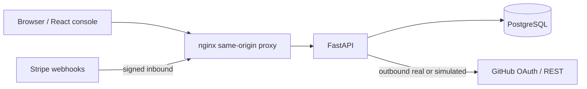

# IntegrationLab

A support and reliability console for debugging third-party API and webhook integrations.

**Problem:** partner integrations fail for many different reasons — expired credentials, permissions, rate limits, provider outages, at-least-once webhooks, duplicate deliveries, processing bugs, and configuration mistakes. Dashboards that invent uptime make that worse.

**Solution:** IntegrationLab turns messy provider behavior into **durable evidence**, **deterministic health**, **guided diagnostics**, and **operator support cases** with correlation and audit — so you can answer what broke, what evidence matters, what the operator did, and what state the investigation is in.

| Reader | Time | Start here |
|--------|------|------------|
| Recruiter | 30s | This intro + Demo + Features |
| Engineer | 3 min | Architecture + Reliability + Security |
| Interviewer | 10 min | Live console, [demo script](docs/demo-script.md), [ADRs](docs/adr/), [case study](docs/customer-case-study.md) |

## Why I built it

Calling an API is easy. Diagnosing a broken customer integration under time pressure is not.

I wanted a portfolio project that proves I can design:

- OAuth connection flows with real security hygiene (state + PKCE + encrypted tokens)
- Stripe-style webhook reliability (raw-body signatures, dedupe, idempotent effects, bounded retries)
- evidence-based reliability (not fake uptime)
- support operations on top of that evidence (cases, timeline, audit, correlation)
- CI packaging and a cost-conscious AWS architecture I can explain honestly

## What it does

- **GitHub OAuth** — authorization code + state + PKCE, Fernet-encrypted tokens, profile + connection check
- **Provider request evidence** — real vs **SIMULATED** clearly separated
- **Failure Lab** — deterministic provider failure reproduction without mutating live health
- **Stripe webhooks** — signature verify → durable receipt → process → 1s/2s/4s retry → failed queue
- **Delivery dedupe + effect idempotency** — at-least-once safe
- **Reliability dashboard** — health derived from stored evidence only (no surprise provider calls)
- **Guided diagnostics** — persisted runs/checks; optional real GitHub probe when asked
- **Support Cases** — lifecycle, severity, notes, evidence pinning, derived timeline
- **Correlation IDs + operator audit** — intent audited before webhook side effects; safe metadata allowlist
- **Docker Compose + CI** — Postgres → migrate → API → nginx UI; six GitHub Actions quality gates
- **Terraform AWS architecture** — CloudFront, S3, ALB, ECS/Fargate, RDS, Secrets Manager, OIDC (apply is manual)

## Demo

Canonical story after the completed external-acceptance run (see [docs/external-acceptance.md](docs/external-acceptance.md) and [docs/verification.md](docs/verification.md)):

1. Real GitHub OAuth connect + encrypted token + `GET /user`
2. Diagnostics / provider evidence (`is_simulated=false`)
3. Support Case → pin evidence → note → status transitions
4. Correlation + audit trail
5. Revoke/reconnect negative path (when demonstrating recovery)
6. Stripe signed webhook → process → duplicate absorption → failed queue (permanent failure classification)

Screenshots (safe only): [docs/assets/portfolio/](docs/assets/portfolio/).

For a deterministic **simulated** dataset without touching providers, use `make demo` and say so out loud.

## Architecture



Domain modules on the API: OAuth + provider requests · Failure Lab · webhook receiver/processor · reliability · diagnostics · Support Cases · audit/correlation.

AWS topology (Terraform; **not auto-applied**): CloudFront → S3 + ALB → ECS Fargate → private RDS; Secrets Manager; GitHub Actions OIDC. Details: [docs/architecture.md](docs/architecture.md), [docs/aws-deployment.md](docs/aws-deployment.md).

## Reliability engineering

- Health ∈ `healthy` / `degraded` / `failed` / `unknown` / `not_configured`
- Missing evidence → `unknown` (never fake healthy)
- Simulations excluded from live health
- Provider **delivery dedupe** ≠ **business-effect idempotency** (both implemented)
- Append-only processing attempts; bounded retries; failed queue for operators

## Security

- OAuth `state` + PKCE; tokens encrypted at rest
- Stripe signatures over the **exact raw body**
- Single-operator Bearer gate in production (runtime key; not baked into Vite)
- Audit allowlist; no tokens/bodies/Authorization headers in audit metadata
- Threat model: [docs/threat-model.md](docs/threat-model.md)

Not multi-user RBAC. Not multi-tenant authz.

## Testing & CI

```bash
make verify        # pytest + frontend lint/build + terraform validate
make full-verify   # above + assembled Compose smoke
```

CI on every PR/`main` push: backend tests (Postgres 18 + `_test` guard), frontend quality, both container builds, full-stack smoke, Terraform fmt/validate.

Claim → evidence matrix: [docs/verification.md](docs/verification.md).

## Verification vocabulary

| Status | Meaning |
|--------|---------|
| **Implemented** | Code/config exists |
| **CI verified** | Repository automation exercised it |
| **Locally verified** | Ran on a developer machine |
| **Externally verified** | Real provider/cloud step succeeded |

AWS `terraform apply` remains **not Externally verified** (cost-gated). GitHub OAuth,
real `GET /user`, revoke/reconnect, Stripe CLI signed delivery + duplicate absorption +
failed-queue evidence, and a support case from real evidence are **Externally verified**
on Compose — see [docs/verification.md](docs/verification.md) and
[docs/external-acceptance.md](docs/external-acceptance.md).

Portfolio screenshots: [docs/assets/portfolio/](docs/assets/portfolio/).

## Engineering decisions worth discussing

1. PostgreSQL as the retry/dedupe store instead of adding Redis/Kafka for v1
2. ContextVar UUID correlation before adopting OpenTelemetry
3. Support timeline **derived** from history + notes + linked evidence (`occurred_at` vs `pinned_at`)
4. Sequence-generated `CASE-#####` numbers (race-safe; gaps OK)
5. Webhook process **intent** audited and committed before the processor’s multi-transaction work
6. Real vs simulated evidence never silently mixed into live health

ADRs: [docs/adr/](docs/adr/).

## Run locally

**Full local Compose stack (preferred for demos):**

```bash
cp .env.example .env   # then fill secrets (see docs/external-acceptance.md)
make compose-up
# UI http://localhost:8080  — unlock with OPERATOR_API_KEY
make demo              # optional simulated dataset
```

**Day-to-day split process:** Postgres via `docker compose up -d postgres`, backend venv + `uvicorn`, frontend `npm run dev` (see `.env.example`).

## AWS architecture

Terraform under `infra/terraform` defines the portfolio topology. Cost-conscious defaults (no NAT, single-AZ RDS, one task).

**Not deployed unless you explicitly `terraform apply` and accept cost.** Do not read this README as “hosted in AWS.”

## Limitations (honest)

- Single-operator access (no SSO/RBAC/multi-tenancy)
- No WAF / application rate limiter in the default stack
- Webhook processing is operator/CLI-triggered (no always-on worker by default)
- No Stripe Events reconciliation, provider-status correlation, or batch recovery yet ([Phase 2 backlog](docs/phase-2-backlog.md))
- CloudFront→ALB HTTP in the portfolio design (viewer HTTPS); real sensitive use needs origin TLS
- AWS stack is implemented + CI-validated, not automatically applied

## Docs index

| Doc | Topic |
|-----|-------|
| [external-acceptance.md](docs/external-acceptance.md) | Real GitHub/Stripe acceptance checklist |
| [support-operations.md](docs/support-operations.md) | Cases, audit, correlation, timeline |
| [verification.md](docs/verification.md) | Claim → evidence matrix |
| [demo-script.md](docs/demo-script.md) | 60s + 5-minute walkthrough |
| [interview-questions.md](docs/interview-questions.md) | Concise Q&A |
| [resume-bullets.md](docs/resume-bullets.md) | Resume-ready bullets |
| [linkedin-post.md](docs/linkedin-post.md) | Project post draft |
| [phase-2-backlog.md](docs/phase-2-backlog.md) | Explicitly not built yet |
| [threat-model.md](docs/threat-model.md) | Trust boundaries |
| [customer-case-study.md](docs/customer-case-study.md) | Incident exercise |
