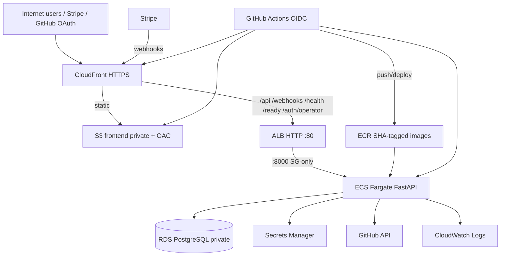

# IntegrationLab Architecture — OAuth, Failure Lab, Webhooks, Reliability, Diagnostics

IntegrationLab has three evidence-producing flows: real outbound calls to
GitHub, simulated outbound calls from Failure Lab, and inbound Stripe webhooks.
Two operator flows sit on top of that evidence: the reliability dashboard, which
only reads it, and guided diagnostics, which actively collects more.

## High-level

```text
Browser
  → React
  → FastAPI
  → (real GitHubClient | Failure Lab simulator)    outbound
  → ProviderHttpResult
  → PostgreSQL (request logs / failure runs / OAuth tables)

Stripe
  → FastAPI public webhook route                   inbound
  → PostgreSQL (webhook_events / attempts / effects)
```

## Operator access boundary

The console has a single-operator bearer gate when `OPERATOR_API_KEY` is
configured; production refuses to boot without a sufficiently long key.

```text
React console
  → GET /auth/operator              public: is auth required?
  → GET /api/auth/check             Bearer required
  → remaining operator /api routes  Bearer required

Public exceptions
  → Stripe webhook receipt          Stripe signature
  → GitHub OAuth callback           OAuth state + PKCE
  → GitHub connect redirect         unguessable integration UUID; starts OAuth only
  → /health + /ready                infrastructure probes
```

The key is entered at runtime and kept in browser `sessionStorage`; it is not
compiled into the frontend. This is intentionally single-operator access, not
multi-user identity/RBAC. See [threat-model.md](threat-model.md).

## Outbound vs inbound observability

| | Outbound | Inbound |
|---|----------|---------|
| Who initiates | IntegrationLab calls the provider | Provider calls IntegrationLab |
| Examples | GitHub token exchange, `/user`, Failure Lab | Stripe webhooks |
| Stored in | `provider_request_logs` | `webhook_events` (+ attempts, effects) |

Inbound webhooks are intentionally **not** written to `provider_request_logs`.

## Real provider path (outbound)

```text
React
  → FastAPI (connect / callback / check)
  → GitHubClient (httpx)
  → GitHub
  → ProviderHttpResult
  → provider_request_logs (is_simulated=false)
  → credentials / profile / status updates (real only)
```

## Failure Lab path (outbound, simulated)

```text
React Failure Lab
  → POST /api/failure-lab/run
  → FailureLabService
  → ProviderFailureSimulator (no network)
  → ProviderHttpResult
  → provider_request_logs (is_simulated=true, scenario=...)
  → FailureDiagnosisEngine (evidence → diagnosis)
  → failure_lab_runs
  → JSON result → UI
```

Both outbound paths converge on `ProviderHttpResult`, so diagnosis reasons
about evidence rather than about which button was clicked. Simulations never
mutate real connection health or decrypt tokens. Failure Lab data never goes
into the webhook tables.

## Stripe webhook path (inbound)

```text
INBOUND (in the HTTP request)
Stripe
  → POST /webhooks/stripe/{integration_id}  (exact raw body)
  → StripeWebhookReceiver
  → stripe.Webhook.construct_event  (signature + timestamp tolerance)
  → normalize safe fields
  → dedupe (INSERT … ON CONFLICT DO NOTHING / delivery_count + 1)
  → PostgreSQL commit
  → HTTP 200 {"received": true, "duplicate": …}

PROCESSING (outside the request)
webhook_events row
  → StripeWebhookProcessor (CLI or POST /process-due)
  → claim: FOR UPDATE SKIP LOCKED → processing + attempt row
  → HandlerRegistry → event handler
  → webhook_effects (ON CONFLICT DO NOTHING) + processed   (one commit)

RETRY
handler raises RetryableWebhookError
  → attempt row closed as failed
  → WebhookRetryPolicy (1s / 2s / 4s, 4 attempts)
  → retry_scheduled + next_attempt_at
  → next process-due tick
  → success  OR  failed queue (manual retry / dismiss)
```

Stripe's own delivery retries are a separate system:

```text
STRIPE DELIVERY RETRY (owned by Stripe)
Stripe → our endpoint → no 2xx (timeout / 4xx / 5xx) → Stripe re-sends later
```

We return 2xx once the event is durably stored, even if processing will later
fail; internal failures are handled by our own retry engine. See
[stripe-webhooks.md](stripe-webhooks.md).

The public webhook route is `async` so it can read the exact raw body. The
blocking receiver then runs in the threadpool, and it opens its **own**
SQLAlchemy `Session` inside that worker thread and closes it there. A Session
is never shared between the event-loop thread and a threadpool thread.

## Reliability read path (passive)

```text
PostgreSQL evidence
  (provider_request_logs is_simulated=false, webhook_events + attempts,
   failure_lab_runs, diagnostic_runs)
  → reliability repository (grouped aggregate queries)
  → health evaluator (pure, deterministic rules)
  → GET /api/reliability/{overview, integrations/{id}, failures, request-metrics}
  → Overview / Requests / Failures pages
```

**Loading the dashboard does NOT call GitHub or Stripe.** Every number and
health state comes from rows already in PostgreSQL. Refreshing the page,
including the optional 60-second auto-refresh, only runs SQL. If PostgreSQL is
unreachable, the API returns a single 503 "Database unavailable" and no
integration is marked failed. See [reliability.md](reliability.md).

## Diagnostics path (active)

```text
UI (Diagnostics page)
  → POST /api/diagnostics/{integration_id}/run
  → DiagnosticsService (run row committed as "running"; 409 if one is in flight)
  → provider-specific checks
       GitHub: config → credential → decrypt → optional real GET /user probe
               (only when a credential decrypts; logged as a real request)
       Stripe: config + stored webhook evidence (no outbound calls)
  → diagnostic_checks rows + overall status + summary (persisted)
  → run JSON → UI (and history via GET /api/diagnostics/{id}/runs)
```

**Active diagnostics DO call providers**, but only the GitHub probe, and only
when an operator explicitly asks. Checks never change `integrations.status`,
credentials, or webhook events. See [diagnostics.md](diagnostics.md).

## Layers

| Layer | Role |
|-------|------|
| Routes (`app/api`) | HTTP (public webhook router, operator routers, reliability, diagnostics) |
| Services | OAuth, GitHub client, Failure Lab, diagnosis, webhook receiver/processor/handlers/retry policy, reliability rules/evaluator, diagnostic checks |
| Repositories | DB access (incl. idempotent inserts, row locking) |
| ORM (`app/db/models`) | Tables |
| Pydantic (`app/models`) | API contracts |
| Scripts (`app/scripts`) | seed, `process_webhooks` worker tick |

## OAuth

Start → state + PKCE → GitHub → callback → token exchange → `/user` → encrypted
credential + profile → frontend redirect.

Cancel/error callbacks are only honoured for a known, unused, unexpired GitHub
state. Valid state + `access_denied` marks the state used and redirects with
`status=cancelled`. Missing, unknown, expired, or reused state → HTTP 400.
`error_description` is never reflected.

## AWS deployment architecture

Infrastructure is defined in `infra/terraform` (apply is user-controlled).



Cost-conscious portfolio topology: public ALB + public Fargate tasks with
public IPs (no NAT), private RDS, CloudFront-restricted ALB when the managed
prefix list is available. See [aws-deployment.md](aws-deployment.md) and
[adr/005-public-fargate-no-nat-dev.md](adr/005-public-fargate-no-nat-dev.md).

## Intentional non-goals

- Redis / Celery / SQS as a required runtime dependency
- Continuous background monitoring or paging alerts
- Real payment mutations or Stripe API writes
- AI diagnosis
- Multi-user identity, RBAC, or multi-tenancy (single-operator bearer gate only)
- Auto `terraform apply` from pull requests
- NAT Gateway / Multi-AZ RDS in the default portfolio stack

Production background webhook scheduling is still operator/CLI triggered unless
explicitly added later.

## Related docs

- [reliability.md](reliability.md)
- [diagnostics.md](diagnostics.md)
- [stripe-webhooks.md](stripe-webhooks.md)
- [failure-lab.md](failure-lab.md)
- [github-oauth.md](github-oauth.md)
- [database.md](database.md)
- [aws-deployment.md](aws-deployment.md)
- [ci-cd.md](ci-cd.md)
- [verification.md](verification.md)
- [threat-model.md](threat-model.md)
- [customer-case-study.md](customer-case-study.md)
- [adr/](adr/)
