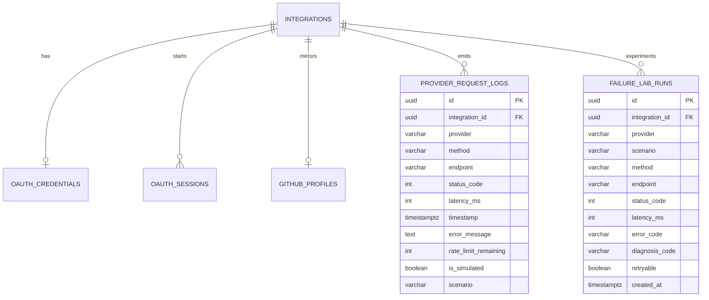

# Database Notes

PostgreSQL stores integrations, OAuth artifacts, provider request logs, and
Failure Lab runs.

## ER overview

```text
integrations
  │
  ├── oauth_credentials
  ├── oauth_sessions
  ├── github_profiles
  ├── provider_request_logs   (real + simulated)
  └── failure_lab_runs
```



## Why simulated vs real logs must be distinguishable

Failure Lab writes provider request logs so the dashboard can show latency/status
evidence. Without `is_simulated` (and `scenario`), a simulated 401 would look
identical to a real GitHub 401 and could mislead operators.

UI badges:

- **Real** — outbound GitHub traffic
- **Simulated** — Failure Lab experiment

## Migrations

| Revision | Purpose |
|----------|---------|
| `001_create_integrations` | Base integrations |
| `002_github_oauth_and_logs` | OAuth + profiles + request logs |
| `003_failure_lab` | `is_simulated`/`scenario` + `failure_lab_runs` |

```bash
alembic upgrade head
alembic downgrade -1
alembic upgrade head
```

Do not edit 001/002 after merge.

## Encryption

Access tokens remain Fernet-encrypted. Failure Lab never decrypts them.

## Test database

Pytest uses `integrationlab_test` (name must end with `_test`) and truncates
Failure Lab tables between tests.
