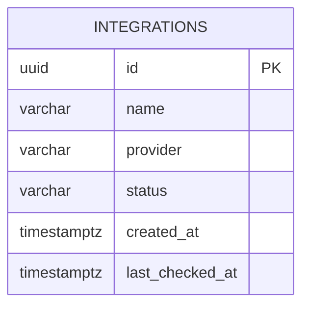

# Database Notes (Interview Study)

Plain-English notes for IntegrationLab's PostgreSQL persistence milestone.

## PostgreSQL

PostgreSQL is a relational database. It stores data in tables (rows and columns)
and guarantees durability: when a transaction commits, the data is written so it
survives process restarts.

IntegrationLab uses PostgreSQL 18 locally via Docker Compose.

## Table: `integrations`

```text
integrations
---------------------
id               UUID PK
name             VARCHAR(100) NOT NULL
provider         VARCHAR(50)  NOT NULL
status           VARCHAR(50)  NOT NULL
created_at       TIMESTAMPTZ  NOT NULL
last_checked_at  TIMESTAMPTZ  NULL
```



**Primary key:** `id` uniquely identifies one integration row. We generate UUIDs
in the application so IDs exist before insert and stay portable.

No extra indexes yet — the table is tiny and the primary key already supports
lookups by id. Index later when real query patterns (logs/webhooks) appear.

### Future (not built yet)

Later milestones may add tables for OAuth credentials, API request logs,
webhooks, and retries. Those are out of scope for this milestone.

## provider / status storage tradeoff

Allowed values today:

- provider: `github`, `stripe`
- status: `not_connected`, `connected`, `needs_setup`

We store them as **strings** in PostgreSQL and enforce allowed values in
**Python/Pydantic**.

Why not native Postgres ENUMs?

- Changing Postgres ENUM values requires careful migrations
- Application enums are easier to evolve early
- Validation still happens at the API boundary

## ORM (SQLAlchemy)

An ORM maps Python classes to database tables.

- Class `IntegrationORM` ↔ table `integrations`
- Instance attributes ↔ columns
- `session.add(obj)` stages an INSERT/UPDATE
- Querying returns Python objects instead of raw tuples

Pydantic models stay separate: they are the **API contract**, not the table map.

## Engine

The **Engine** is connection infrastructure:

- Knows the database URL
- Owns a **connection pool**
- Creates DBAPI connections (via psycopg) as needed

There is typically one Engine per process.

## Session

A **Session** is a unit of work:

- Tracks ORM objects you load/create
- Batches SQL
- Belongs to one request in our FastAPI design (`get_db`)

Do not share one Session across concurrent requests.

## Transaction

A transaction is an atomic set of database operations.

- **commit** — make changes permanent
- **rollback** — undo uncommitted changes after an error

Create flow:

1. Build ORM object
2. `session.add()`
3. `session.commit()`
4. `session.refresh()` to reload DB defaults/state
5. Return the persisted object

If commit fails, we rollback and return a safe 5xx to the client.

## Connection pooling

SQLAlchemy's Engine keeps a pool of open connections.

- Opening a TCP/auth round-trip every query would be slow
- The pool reuses connections
- Sessions borrow connections as needed

We use SQLAlchemy defaults (+ `pool_pre_ping=True`). No PgBouncer/Redis yet.

## Migration (Alembic)

**ORM model ≠ live database schema.**

Changing `IntegrationORM` in Python does not alter an existing PostgreSQL
database by itself.

Alembic migration files describe schema changes over time:

```bash
alembic upgrade head     # apply migrations
alembic downgrade -1     # revert one revision
alembic current          # show applied revision
```

We do **not** use `Base.metadata.create_all()` as the normal schema strategy.
Migrations are explicit and checked into Git.

## Repository layer

Routes should not contain random SQL.

`IntegrationRepository` owns list/create (and helpers for seed/get).

Benefits:

- HTTP layer stays thin
- Database logic is testable
- Storage can evolve without rewriting route signatures

## Persistence

Day 1 stored integrations in a Python list. Restarting FastAPI wiped them.

Now rows live in PostgreSQL. Restarting FastAPI reconnects and reads the same
rows. That is the core proof of this milestone.

## Environment variables

`DATABASE_URL` (and `TEST_DATABASE_URL`) keep credentials out of source code.

- `.env` is gitignored
- `.env.example` documents safe local defaults
- API responses never include `DATABASE_URL`

## Liveness vs readiness

- **Liveness** (`GET /health`): is the process alive?
- **Readiness** (`GET /ready`): can it reach PostgreSQL?

A living process can still be unready if the database is down.

## Why sync SQLAlchemy right now?

Current FastAPI routes are synchronous. Sync SQLAlchemy matches that style and
avoids async session/engine complexity before we need it.

## Why no PgBouncer / Redis / queues yet?

Those tools solve scale and async workload problems we do not have. Adding them
now would obscure the persistence learning goal.

## Test database

Pytest uses `integrationlab_test`, not `integrationlab`.

Fixtures refuse to truncate a database whose name does not end with `_test`, so a
misconfigured `TEST_DATABASE_URL` fails loudly instead of wiping demo data.
