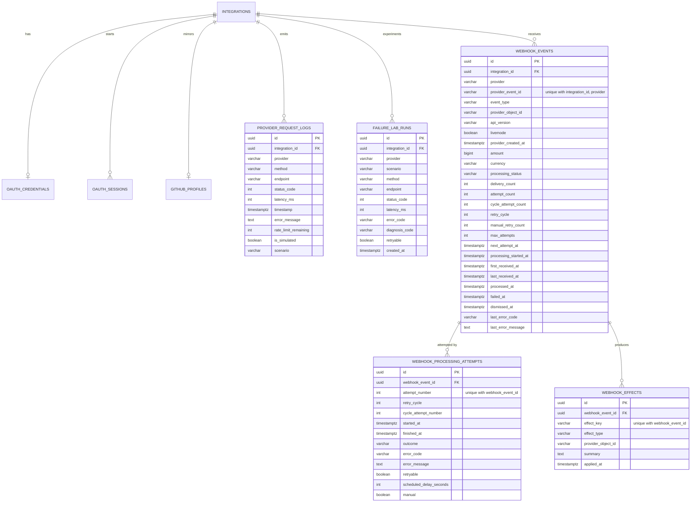

# Database Notes

PostgreSQL stores integrations, OAuth artifacts, provider request logs, Failure
Lab runs, and Stripe webhook events with their processing history.

## ER overview

```text
integrations
  │
  ├── oauth_credentials
  ├── oauth_sessions
  ├── github_profiles
  ├── provider_request_logs   (outbound: real + simulated)
  ├── failure_lab_runs
  └── webhook_events          (inbound)
        ├── webhook_processing_attempts
        └── webhook_effects
```



## Webhook tables

### `webhook_events`

One row per **logical** Stripe event per integration, holding only safe
normalized metadata. There is no raw body column, and no customer or payment
method data.

- `uq_webhook_events_integration_provider_event (integration_id, provider, provider_event_id)`:
  delivery dedupe. Receipt uses `INSERT … ON CONFLICT DO NOTHING`; on conflict
  it atomically increments `delivery_count` and updates `last_received_at`.
- `attempt_count` counts attempts across all cycles. `cycle_attempt_count` is
  checked against `max_attempts` (4) and resets on manual retry, when
  `retry_cycle` is incremented.
- Index `(processing_status, next_attempt_at)` serves the due-event query;
  `first_received_at` serves newest-first listing.

### `webhook_processing_attempts`

Append-only processing history, one row per attempt:
`in_progress → succeeded | ignored | failed | abandoned`. It records
`scheduled_delay_seconds` for retries and `manual` for operator-triggered
attempts. `uq_webhook_attempts_event_attempt_number` prevents two attempts from
claiming the same number. Manual retry and dismiss never delete rows.

### `webhook_effects`

Internal side effects (`payment_success_recorded`, `payment_failure_recorded`,
`refund_recorded`). `uq_webhook_effects_event_effect_key` plus
`ON CONFLICT DO NOTHING` makes each effect apply at most once, even across
redelivery, reprocessing, crashes, or manual retries. The effect insert and the
`processed` status change commit together.

All child tables use `ON DELETE CASCADE` from their parent.

## Why simulated vs real logs must be distinguishable

Failure Lab writes provider request logs so the dashboard can show latency and
status evidence. Without `is_simulated` (and `scenario`), a simulated 401 would
look identical to a real GitHub 401 and could mislead operators.

UI badges:

- **Real**: outbound GitHub traffic
- **Simulated**: a Failure Lab experiment

## Migrations

| Revision | Purpose |
|----------|---------|
| `001_create_integrations` | Base integrations |
| `002_github_oauth_and_logs` | OAuth + profiles + request logs |
| `003_failure_lab` | `is_simulated`/`scenario` + `failure_lab_runs` |
| `004_stripe_webhooks` | `webhook_events`, `webhook_processing_attempts`, `webhook_effects` |

```bash
alembic upgrade head
alembic downgrade -1
alembic upgrade head
```

Do not edit 001–003 after merge.

## Encryption

Access tokens remain Fernet-encrypted. Failure Lab never decrypts them. The
Stripe webhook secret is read from the environment only and is never stored in
the database.

## Test database

Pytest uses `integrationlab_test` (the name must end with `_test`). Between
tests it truncates all application tables, including the webhook tables.
